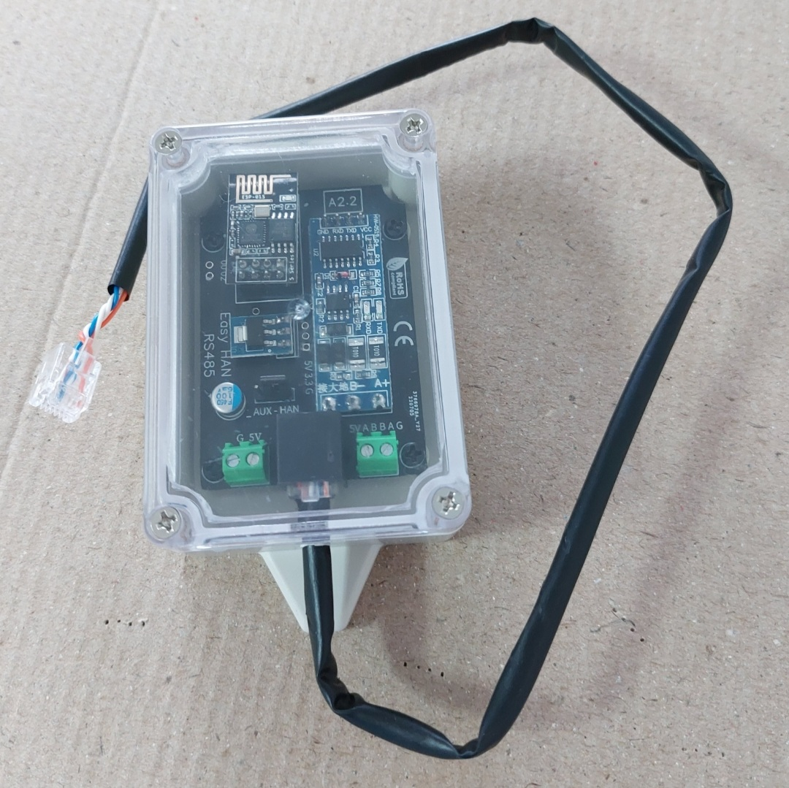

# Easy HAN RS485
Leitor da porta han



<i>Imagem demonstrativa</i>

Mais info no [```discord```](https://discord.gg/Mh9mTEA)

[](https://discord.gg/Mh9mTEA) 

E no forum:

https://forum.cpha.pt/t/easy-han-rs485-edpbox-helpdesk/9977

# Testados

**Alimentação directa na HAN**

Monofásicos:

- ```Kaifa MA109P```

- ```Landis+Gyr```

- ```Sagemcom CX1000```

- ```Sagemcom S212```

Trifásicos:

- ```Janz B2801 GPRS```

- ```Sagemcom CX2000```

Notas:

Landis+Gyr: Serial mN1/mN2.
