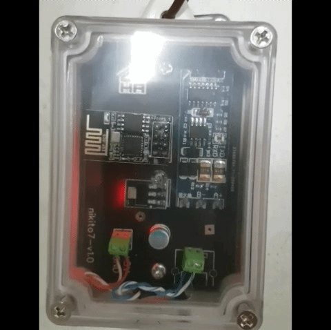

# Generic ESP8266

- [```cpha.pt/tutorial```](https://forum.cpha.pt/t/integrar-contador-edp-ziv-com-tasmota-parte-1-3/7689)

- [```youtube/francisco```](https://youtu.be/RhYSgaTymT8)

# Discord

- [```cpha.pt/discord```](https://discord.gg/Mh9mTEA)

# Erro 84/81

> Em decimal: 132/129. 
> (pymodbus...)


> contactar a e-redes.
>
>> se na rede inteligente, é resolvido remotamente.
>>
>> caso contrário, é trocado o contador.

# Easy HAN Box




Mais info via mensagem no Discord.

---

**Alimentação directa na HAN: Testados**

Monofásicos:

```Kaifa``` (plc=0, modem=0) 

```Landis``` (plc=0, modem=0) 

Trifásicos:

```Janz GPRS``` (gsm=1) 
