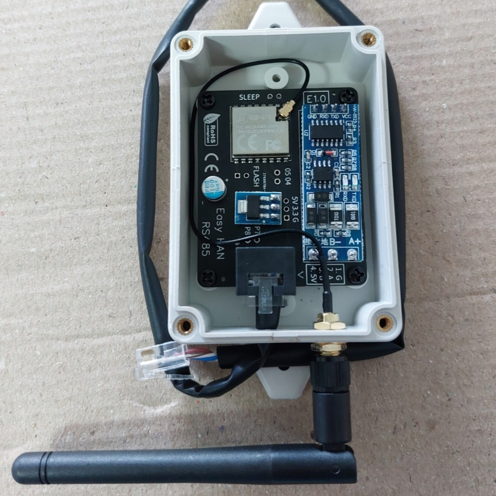
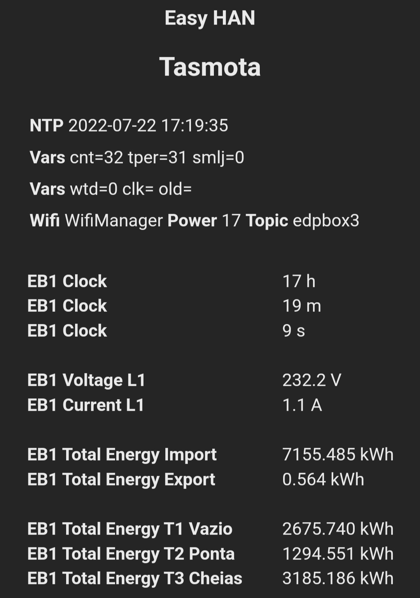
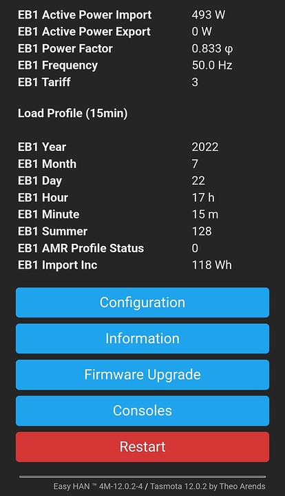

# Easy HAN

Leitor/Medidor da porta HAN.

Acesso aos dados do contador.

Adaptador Modbus para WiFi.



<i>Imagem demonstrativa</i>

Mais info no [```discord```](https://discord.gg/Mh9mTEA) da CPHA.

[](https://discord.gg/Mh9mTEA) 

E no forum:

- https://forum.cpha.pt/t/easy-han-wifi-edpbox-rs485/9977

- https://forum.cpha.pt/t/easy-han-tasmota-configuracao-wifi-mqtt/10486

# Contadores
> Testados com alimentação directa na HAN

Monofásicos:

- ```Kaifa MA109P```

- ```Landis+Gyr```

- ```Sagemcom CX1000```

- ```Sagemcom S212```

Trifásicos:

- ```Janz B2801 GPRS```

- ```Sagemcom CX2000```

Notas:

Landis+Gyr: Serial mN1/mN2.

# Pedido da HAN

https://www.e-redes.pt/pt-pt/transicao-energetica/redes-do-futuro/acesso-porta-serie-de-comunicacao

# Imagens






# Home Assistant


https://www.home-assistant.io/

# Site

https://easyhan.pt/?git
