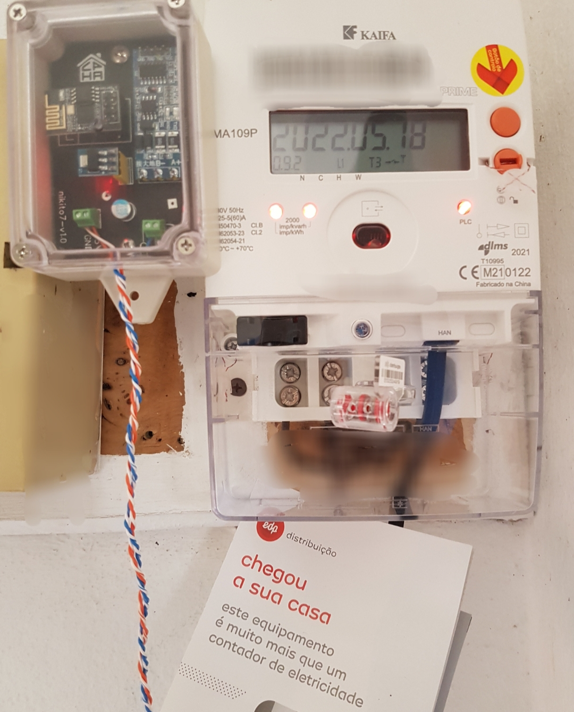

# Easy HAN RS485



<i>Imagem demonstrativa</i>

Mais info [```aqui```](https://forum.cpha.pt/t/easy-han-edpbox-rs485/10279)

# Testados

**Alimentação directa na HAN**

Monofásicos:

```Kaifa MA109P``` (plc led vermelho) 

```Kaifa MA109P``` (plc led verde)

```Landis+Gyr``` (plc led vermelho) 

```Sagemcom CX1000-6``` (plc led verde)

Trifásicos:

```Janz B2801 GPRS``` (gsm led verde) 

```Sagemcom CX2000-9``` (plc led vermelho)

# Discord

[```cpha.pt/discord```](https://discord.gg/Mh9mTEA)

[](https://discord.gg/Mh9mTEA) 
