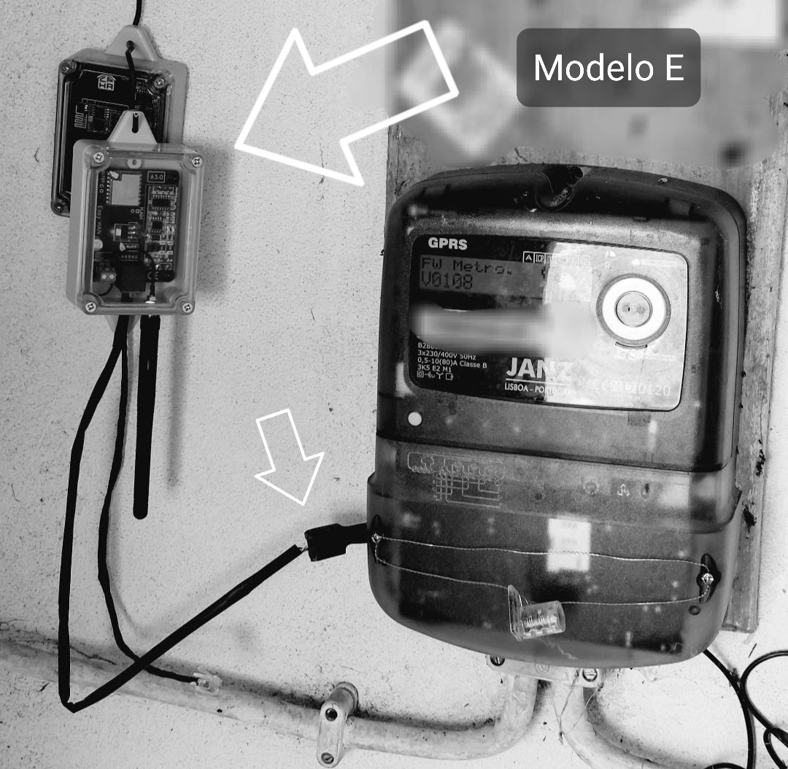

- Modbus to WiFi dev

- edpbox dev

---

Some files moved to:

https://github.com/nikito7/easyhan/

---

Drivers:

https://www.silabs.com/documents/public/software/CP210x_Universal_Windows_Driver.zip

---
---

# Easy HAN

Leitor da porta HAN.

Medidor de consumo via porta HAN. 

Acesso aos dados do contador.

Acesso ao Diagrama de Carga (netmetering)

Adaptador Modbus para WiFi.

<i>Imagem demonstrativa</i>

 

Mais info no forum:

https://forum.cpha.pt/t/easy-han-rs485-edpbox-modbus/9977

...
---

 

google tests stuff:

https://easyhan.pt/galeria.html

https://easyhan.pt/tutoriais.html

https://www.facebook.com/easyhan.pt

