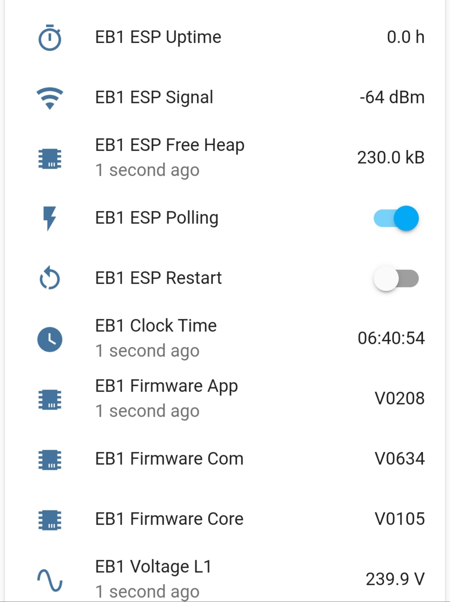
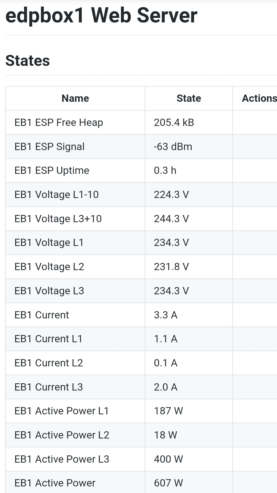

# Info

https://github.com/martgras/esphome/discussions 🇬🇧

https://github.com/martgras/esphome/tree/modbus_component

https://github.com/martgras/esphome/archive/refs/heads/modbus_component.zip

https://github.com/martgras/esphome/tree/modbus_component/esphome/components/modbus_controller

usage:

```
pip uninstall esphome
```

```
pip install https://github.com/martgras/esphome/archive/refs/heads/modbus_component.zip
```

# HA




# ESPHOME



