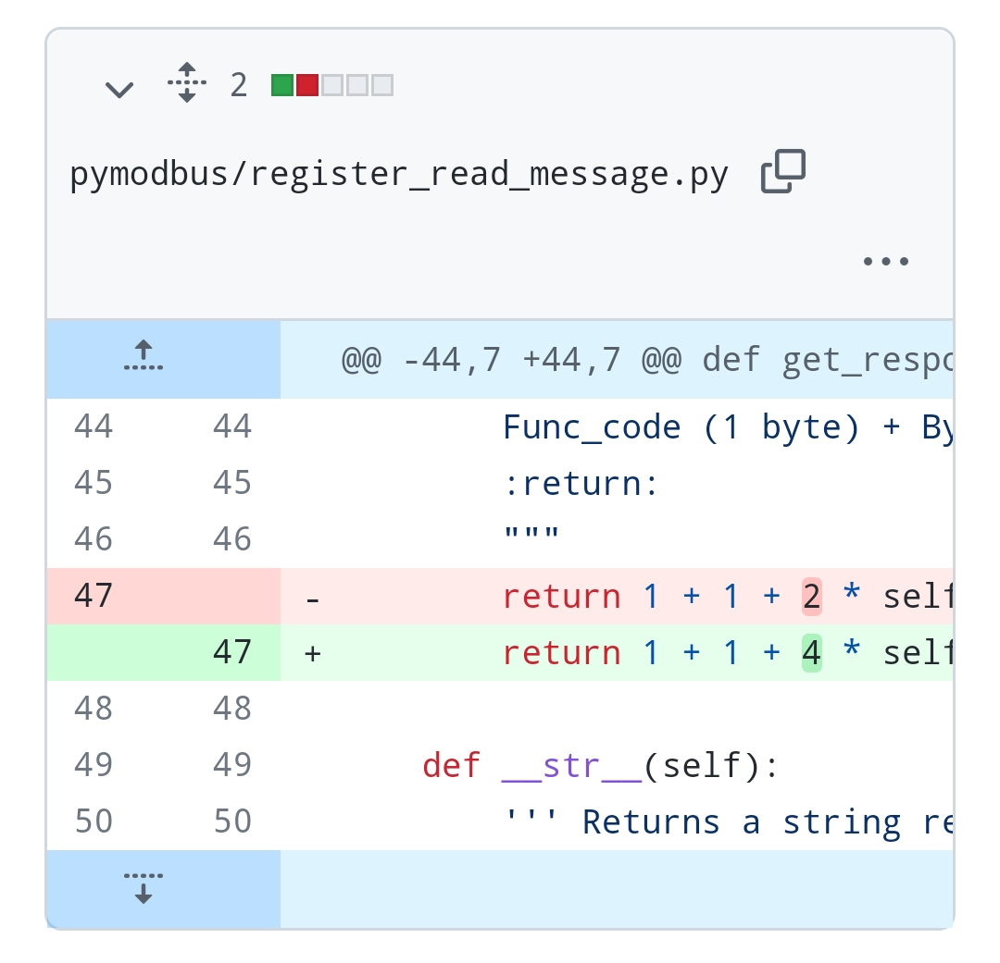

https://github.com/nikito7/easyhan/tree/dev/bridge/custom-ha

---

Standard Modbus:

- Modbus TCP
- HF Elfin
- HF Protoss

<hr>

EB3 to EB1:

```
- Voltage L1
- Current L1
- Active Power (total)
- Power Factor (total)
...
```

<hr>

pymodbus rtu tweak 32bits


